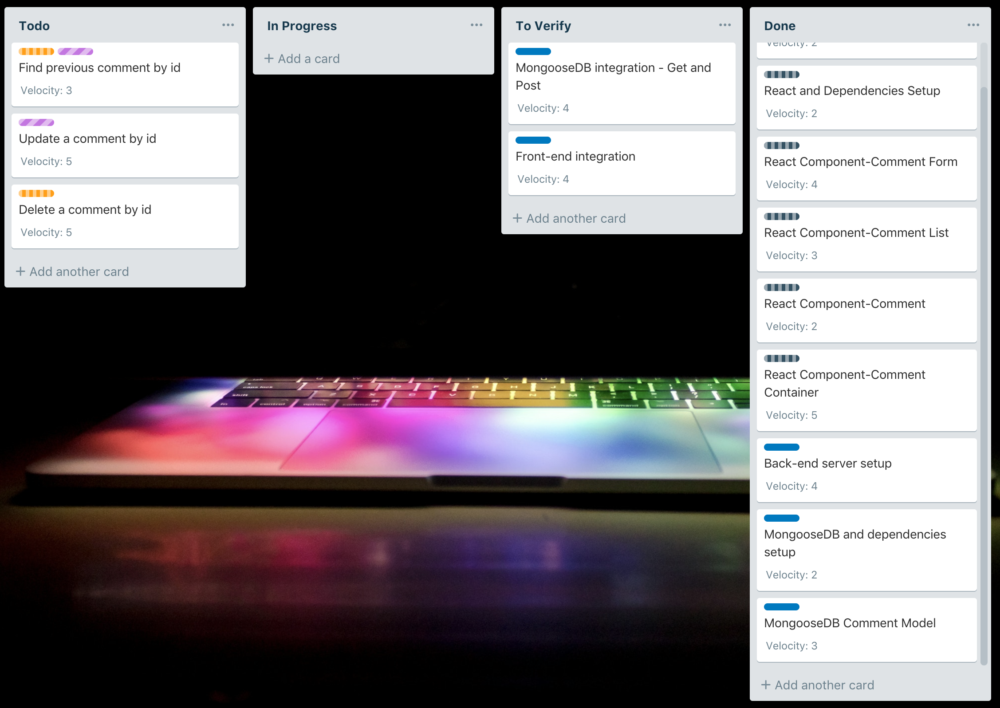

# 75% Progress Report
*Prototype idea: MERN Comment Section*

## Retrospectives

### Executive summary
The prototype is about making a fully functional prototype of the Facebook Comment section, 
including adding new comment, viewings all previous comments, modifying a comment and deleting a comment.

### What went well
During learning and developing the prototype, I found it quite simple to create and quickly modify a React project. 
Also, it's really convenience working with npm dependencies.

### What did not go well
Although I have mentioned that it's convenience working with dependencies, there are problems with that too. 
A project can end up with too many unnecessary dependencies or updating dependencies can cause errors.

### What was interesting
I am still working on React stage updating since it is not working as I expected. 
When I fill in a comment form and submit it, I am not able to clear the text. 
I have researched the issue but there's not a proper solution yet. 

### Plan for next week
* Figure out how to fix the stage update
* Add modify and delete comment function

### Backlog

### [Previous post](prototype-idea.md)
### [Go back home](index.md)

