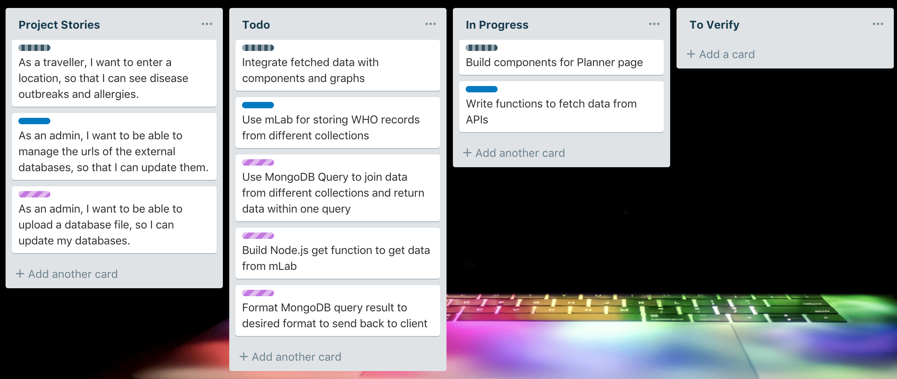
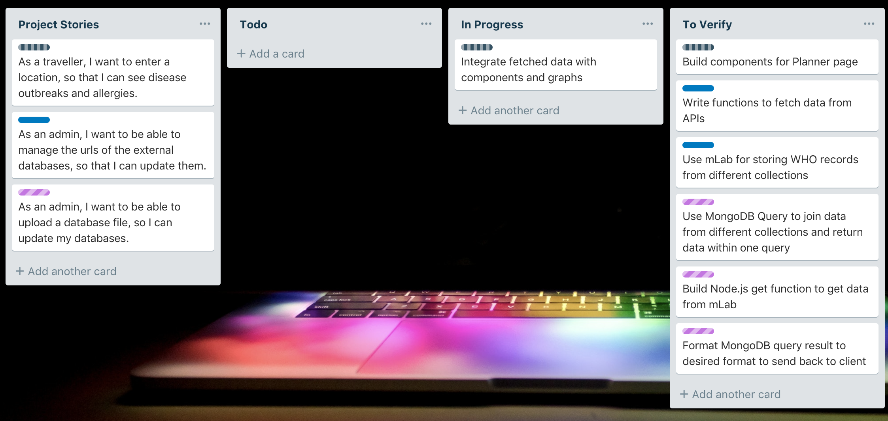
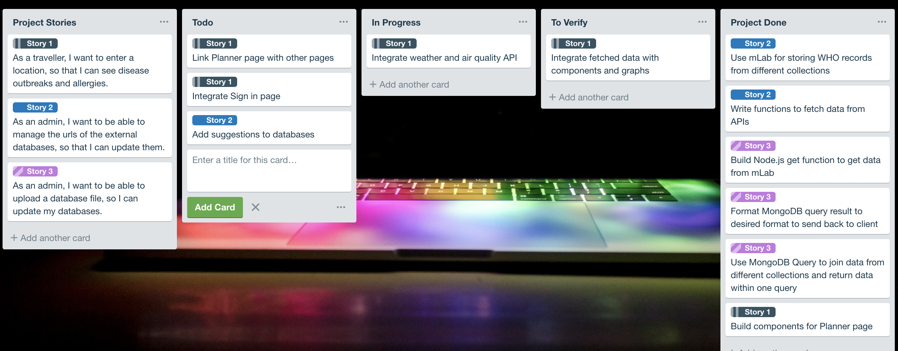
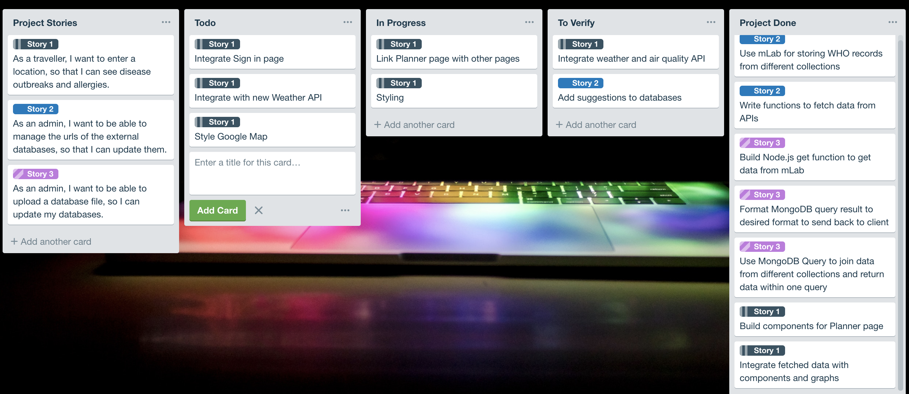
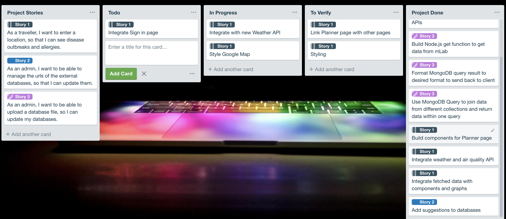
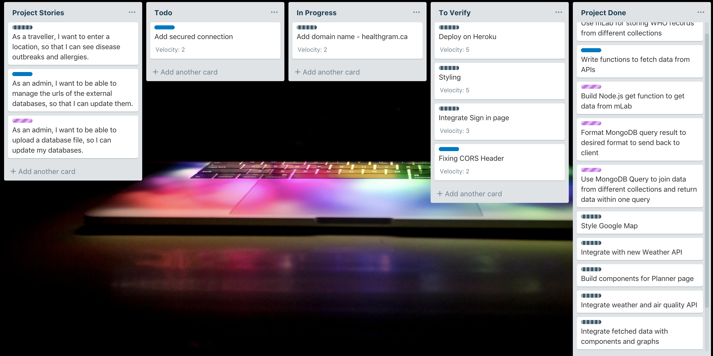

# Project Report

## 20% Report

### Retrospective
+ **Executive summary:** For our project, I will be in charge of getting data from WHO database about different diseases. I use [Rechart](http://recharts.org/en-US) to display charts for our planner page. 
+ What went well: Rechart is really easy to use and understand
+ WHat did not go well: I tried to fetch data from React from 3 different WHO's databases at the same time but it did not work

### Plan for next week
+ Write node.js backend to fetch data
+ Format data to send back to React

### Backlog

## 40% Report

### Retrospectives
+ **Executive summary:** This week, I have figure out the problem, which is each disease has a different databases and we want to filter some of the data in just one call.
+ What went well: I used mLab to manage all WHO disease databases in different collections and retrieve the data that I need in just one call.
+ What did not go well: Automation: If we add more databases to mLab, I need to edit the query to update the call.
+ What was interesting: I learnt so much more: JS async process, MongoDB query and import/export JSON files to mLab through command line.

### Plan for next week
+ Integrate front-end with back-end
+ Integrate with other pages

### Backlog

## 60% Report

### Retrospectives
+ **Executive summary:** I have finished my backend and integrate with front-end for displaying charts. Now, I need to add more data to the databases. 
+ What went well: The chart is displayed nicely.
+ What did not go well: When adding more databases to mLab, I need to make sure the structure is the same so that it does not have errors. 
+ What was interesting: I become more efficiency working with complex data type.

### Plan for next week
+ Add suggestions for diseases.
+ Integrate other parts of the planner page.

### Backlog

## 80% Report

### Retrospectives
+ **Executive summary:** I have finished putting all components of the Planner page on React. I also publish Node.js backend on Heroku.
+ What went well: By seperate front-end and back-end, I do not have much difficulty with deploying the app on Heroku.
+ What did not go well: Problems with React components, mapping data...
+ What was interesting: Get to reuse React components save me a lot of time.

### Plan for next week
+ Finish styling for the Planner page.
+ Try to deploy front-end to Heroku to see if there's any problem.

### Backlog

## 90% Report

### Retrospectives
+ **Executive summary:** I have finished integrate the Planner page to other pages.
+ What went well: I have done the styling of Planner page, some transition might be integrated. I also finished adjusting other pages.
+ What did not go well: Nothing
+ What was interesting: Learnt how to use React Styled Component.

### Plan for next week
+ Finish the project
+ Deploy to Heroku.

### Backlog

## 95% Report

### Retrospectives
+ **Executive summary:** Our project has been deployed on Heroku. There are some bugs during the deployment process and my team and I are working on fixing them. 
+ What went well: The project has been successfully deployed on Heroku.
+ What did not go well: Problem with CORS and free dyno on Heroku (it sleeps after 30mins of inactivity)
+ What was interesting: Learn how to add custom domain names and how to configure them.

### Plan for next week
+ Add secured connection to the custom domain.

### Backlog

